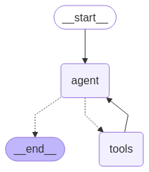

# LangGraph RAG & Search Agent with Ollama

This project demonstrates an AI agent built using LangChain, LangGraph, and Ollama. The agent can answer questions based on a provided resume (stored in `data/cv.txt`) using Retrieval-Augmented Generation (RAG) or search the web for external information using DuckDuckGo.

## Agent Architecture

The following diagram illustrates the logical flow of the agent:



## Features

*   **Conversational Agent**: Interacts with the user via a command-line interface.
*   **Tool Use**: Dynamically decides whether to use a tool based on the user's query.
*   **Resume RAG**: Answers questions about resume content by embedding text chunks and retrieving relevant information.
*   **Web Search**: Uses DuckDuckGo to find information about topics not covered in the resume.
*   **Ollama Integration**: Leverages local Ollama models for both language generation and embeddings, ensuring privacy and offline capability.
*   **Modular Tools**: Tool logic is separated into a `tools` directory.

## Prerequisites

1.  **Conda**: Ensure you have Conda installed. This is used for managing the Python environment. You can install it from [Anaconda Distribution](https://www.anaconda.com/products/distribution) or [Miniconda](https://docs.conda.io/en/latest/miniconda.html).
2.  **Ollama**: Install Ollama by following the instructions on the [Ollama website](https://ollama.ai/).

## Setup

1.  **Clone the Repository (Optional)**:
    If you haven't already, clone the repository:
    ```bash
    git clone <your-repo-url>
    cd <repository-directory>
    ```

2.  **Install and Run Ollama Models**:
    Make sure the Ollama application/server is running. Then, pull the required models (LLM and embedding model):
    ```bash
    ollama pull llama3.2 # The LLM used by the agent (can be changed in agent.py)
    ollama pull nomic-embed-text # The embedding model used for RAG
    ```
    *Important Note: Ollama must be running in the background before starting the agent.*

3.  **Create and Activate Conda Environment**:
    Create a new conda environment (e.g., named `agent-env`) with a specific Python version (tested with 3.12):
    ```bash
    conda create -n agent-env python=3.12 -y
    conda activate agent-env
    ```

4.  **Install Python Dependencies**:
    Install the required Python packages using `pip` and the `requirements.txt` file:
    ```bash
    pip install -r requirements.txt
    ```
5.  **Prepare Resume File**:
    Place your resume content in a file named `cv.txt` in the `data` directory of the project. A sample file is included, but you should replace it with your actual resume text for the RAG tool to work correctly.

## Running the Agent

1.  **Ensure Ollama is running.**
2.  **Activate the Conda environment**:
    ```bash
    conda activate agent-env
    ```
3.  **Run the agent script**:
    ```bash
    python agent.py
    ```

## How to Use

Once the agent starts, it will prompt you for input. You can ask questions like:

*   "What was my most recent job?" (Should trigger the `resume_rag_tool`)
*   "Tell me about LifeMine Therapeutics." (Should trigger the `web_search_tool`)
*   "What is LangGraph?" (Should trigger the `web_search_tool` or be answered directly by the LLM)

Type `quit` or `exit` to end the conversation.

## Project Structure

```
.
├── agent.py            # Main agent script with LangGraph logic
├── data/               # Directory for data files
│   └── cv.txt          # Resume file (replace with your own)
├── docs/               # Documentation assets
│   └── agent_graph.png # Agent architecture diagram
├── requirements.txt    # Python dependencies
├── tools/              # Directory for tool implementations
│   ├── __init__.py
│   ├── resume_rag.py   # RAG tool implementation
│   └── web_search.py   # Web search tool implementation
└── README.md           # This file
```
